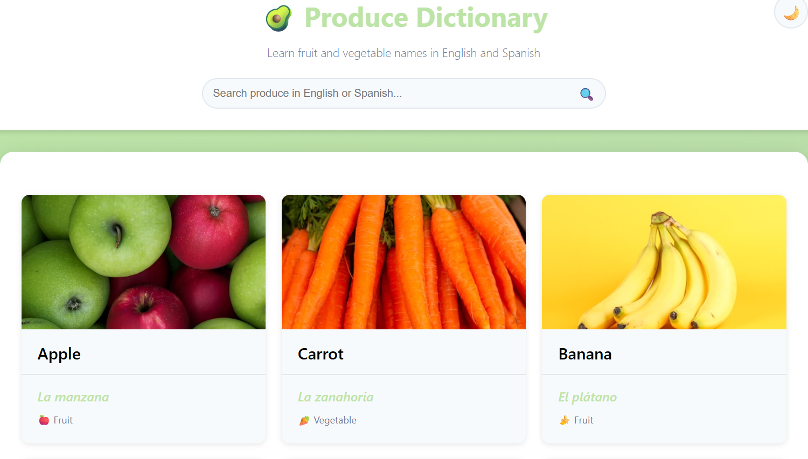

# Produce Dictionary | Diccionario de Frutas y Verduras

An interactive bilingual web application for learning fruit and vegetable names in English and Spanish, built with vanilla HTML, CSS, and JavaScript.

🔗 **[Live Demo](https://mjbusch2121.github.io/Produce-Dictionary/)**



## Features

### Core Functionality
- **36 Produce Items** - Comprehensive collection of common fruits and vegetables
- **Bilingual Learning** - Each item displays names in both English and Spanish
- **High-Quality Images** - Custom-sourced photos from Unsplash for visual learning
- **Real-Time Search** - Filter items instantly by typing in English or Spanish
- **Dark Mode** - Toggle between light and dark themes with persistent preference
- **Fully Responsive** - Adapts seamlessly to desktop, tablet, and mobile devices

### User Experience
- **Instant Filtering** - Search updates as you type with no lag
- **Smart Matching** - Searches both English and Spanish names simultaneously
- **Visual Feedback** - Hover effects and smooth transitions throughout
- **Persistent Settings** - Dark mode preference saved using localStorage
- **Mobile-First** - Touch-friendly interface optimized for all screen sizes

## Tech Stack

- **HTML5** - Semantic markup with accessibility attributes
- **CSS3** - Modern styling featuring:
  - CSS Variables for theme switching
  - CSS Grid for responsive layouts
  - Flexbox for component alignment
  - Media queries for mobile responsiveness
- **Vanilla JavaScript** - No frameworks, pure DOM manipulation
- **localStorage API** - Persistent dark mode preferences

## Project Structure

```
produce-dictionary/
├── index.html          # Main HTML structure
├── styles.css          # All styling and responsive design
├── script.js           # Search and dark mode functionality
├── README.md           # Project documentation
└── screenshot.png      # Preview image (add after deployment)
```

## How to Use

1. **Browse** - Scroll through the dictionary to explore produce items
2. **Search** - Type in the search box to filter by English or Spanish names
3. **Toggle Dark Mode** - Click the sun/moon icon to switch themes
4. **Learn** - Study the bilingual names and visual associations

## Development Journey

This project was built in phases to systematically learn web development fundamentals:

**Phase 1** - Foundation & Setup  
- HTML structure with semantic elements
- CSS Grid layout system
- Basic card styling

**Phase 2** - Images & Interactivity  
- Integrated Unsplash images
- Implemented search functionality
- Added hover effects and transitions

**Phase 3** - Dark Mode  
- Created CSS variable system
- Implemented theme toggle with localStorage
- Smooth theme transitions

**Phase 4** - Mobile Responsive  
- Media queries for tablet and mobile
- Single-column layout for phones
- Touch-optimized interface

## Key Learning Outcomes

- **CSS Variables** - Dynamic theming without JavaScript
- **Event Listeners** - Responding to user input in real-time
- **DOM Manipulation** - Hiding/showing elements programmatically
- **localStorage** - Persisting user preferences across sessions
- **Data Attributes** - Using `data-*` for searchable metadata
- **Responsive Design** - Mobile-first approach with media queries
- **CSS Grid & Flexbox** - Modern layout techniques

## Installation & Setup

No installation required! This is a static website that runs entirely in the browser.

**To run locally:**
1. Clone the repository:
   ```bash
   git clone https://github.com/mjbusch2121/Produce-Dictionary.git
   ```
2. Open `index.html` in your browser
3. That's it! No build process or dependencies needed.

## Browser Compatibility

- ✅ Chrome/Edge (latest)
- ✅ Firefox (latest)
- ✅ Safari (latest)
- ✅ Mobile browsers (iOS Safari, Chrome Mobile)

## Future Enhancements

Potential features for future development:
- [ ] Include seasonality data for each item
- [ ] Fun facts about each fruit/vegetable
- [ ] Audio pronunciation for Spanish words
- [ ] Category filtering (Fruits vs. Vegetables)
- [ ] Expand to 100 produce items
- [ ] Print-friendly study cards

## Why This Project?

I combined my produce industry experience with learning web development fundamentals. Working with familiar content (produce terminology) allowed me to focus entirely on mastering HTML, CSS, and JavaScript without getting overwhelmed by domain knowledge.

## Author

**Mike Busch**  
Building practical projects to learn web development  
[GitHub](https://github.com/mjbusch2121) | [LinkedIn](https://www.linkedin.com/in/mike-busch-0b343a34b/)

## License

MIT License - Feel free to use this project for learning purposes.

---

*Built with 💚 for produce lovers learning Spanish*
